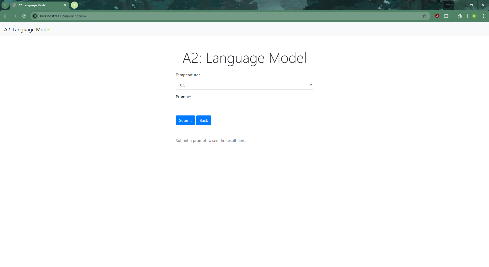

# A2: Language Model

This is the repository for NLP assignment 2.

student information:

- name: Kaung Sithu
- id: st124974

## 1. Dataset Acquisition

The dataset used in this project is the "Short Jokes Dataset," available on the Hugging Face Datasets platform. It is contributed by Maximofn and can be accessed via the following identifier: Maximofn/short-jokes-dataset. The dataset contains 231,657 entries with two fields: ID and Joke.

Link to the dataset: <https://huggingface.co/datasets/Maximofn/short-jokes-dataset>

## 2. Model Training

### Steps Taken to Preprocess the Dataset

The dataset is loaded from HuggingFace. The original dataset is splited into training 70% and testing 30% using specified seed and the testing set is further splited into validation (50%) and test (50%) sets using the same seed.

```python
import datasets
dataset = datasets.load_dataset(dataset_name)
train_test_split  = dataset['train'].train_test_split(test_size=0.3, seed=SEED)
validation_test_split = train_test_split['test'].train_test_split(test_size=0.5, seed=SEED)
```

recombine into DatasetDict for easier usage

```python
split_dataset = {
    "train": train_test_split["train"],
    "validation": validation_test_split["train"],
    "test": validation_test_split["test"],
}
split_dataset = datasets.DatasetDict(split_dataset)
```

extract individual datasets for training, testing, and validation.

```python
train_dataset = split_dataset["train"]
test_dataset = split_dataset["test"]
validation_dataset = split_dataset['validation']
```

tokenize the text in the specified column of each dataset entry. then, apply the tokenize_data function to every example in the dataset and removes the original 'Joke' column.

```python
def tokenize_data(example):
    return {'tokens': tokenizer(example[column_name])}

tokenizer = get_tokenizer('basic_english')

column_name = 'Joke'
tokenized_train_dataset = train_dataset.map(tokenize_data, remove_columns=[column_name])
tokenized_test_dataset = test_dataset.map(tokenize_data, remove_columns=[column_name])
tokenized_validation_dataset = validation_dataset.map(tokenize_data, remove_columns=[column_name])
```

build vocabulary from the tokenized training dataset.

```python
from torchtext.vocab import build_vocab_from_iterator

vocab = torchtext.vocab.build_vocab_from_iterator(tokenized_train_dataset['tokens'], min_freq=3)
vocab.insert_token('<unk>', 0)
vocab.insert_token('<eos>', 1)
vocab.set_default_index(vocab['<unk>'])
```

### Model Architecture and Training Process

The model is an LSTM-based Language Model, designed to predict the next word in a sequence. Here's a breakdown of its architecture:

1. Embedding Layer:
    - Maps each token (word) in the vocabulary to a dense vector of fixed size (emb_dim = 1024).
    - This embedding layer acts as a learnable lookup table for word representations.

2. LSTM Layer:
    - A Long Short-Term Memory (LSTM) network processes sequences of embeddings.
    - It consists of num_layers (2 layers) of LSTMs, each with a hidden state size of hid_dim = 1024.
    - The LSTM captures temporal dependencies in the input sequence while mitigating vanishing gradients.

3. Dropout Layer:
    - Dropout with a rate of dropout_rate = 0.65 is applied to prevent overfitting by randomly deactivating neurons during training.

4. Fully Connected (FC) Layer:
    - A linear layer maps the LSTM's hidden state outputs to a vector of size vocab_size (the number of tokens in the vocabulary).
    - This output represents the logits (unnormalized probabilities) for the next token in the sequence.

5. Weight Initialization:
    - Custom initialization is applied to the embedding layer, FC layer, and LSTM weights to ensure efficient training.

```python

from torch import nn

class LSTMLanguageModel(nn.Module):
    def __init__(self, vocab_size, emb_dim, hid_dim, num_layers, dropout_rate):
        super().__init__()
        self.num_layers = num_layers
        self.hid_dim    = hid_dim
        self.emb_dim    = emb_dim
        self.embedding  = nn.Embedding(vocab_size, emb_dim)
        self.lstm       = nn.LSTM(emb_dim, hid_dim, num_layers=num_layers, dropout=dropout_rate, batch_first=True)
        self.dropout    = nn.Dropout(dropout_rate)
        self.fc         = nn.Linear(hid_dim, vocab_size)
        self.init_weights()

    def init_weights(self):
        init_range_emb = 0.1
        init_range_other = 1/math.sqrt(self.hid_dim)
        self.embedding.weight.data.uniform_(-init_range_emb, init_range_other)
        self.fc.weight.data.uniform_(-init_range_other, init_range_other)
        self.fc.bias.data.zero_()
        for i in range(self.num_layers):
            self.lstm.all_weights[i][0] = torch.FloatTensor(self.emb_dim,
                self.hid_dim).uniform_(-init_range_other, init_range_other) #We
            self.lstm.all_weights[i][1] = torch.FloatTensor(self.hid_dim,   
                self.hid_dim).uniform_(-init_range_other, init_range_other) #Wh
    
    def init_hidden(self, batch_size, device):
        hidden = torch.zeros(self.num_layers, batch_size, self.hid_dim).to(device)
        cell   = torch.zeros(self.num_layers, batch_size, self.hid_dim).to(device)
        return hidden, cell
        
    def detach_hidden(self, hidden):
        hidden, cell = hidden
        hidden = hidden.detach() #not to be used for gradient computation
        cell   = cell.detach()
        return hidden, cell
        
    def forward(self, src, hidden):
        #src: [batch_size, seq len]
        embedding = self.dropout(self.embedding(src)) #harry potter is
        #embedding: [batch-size, seq len, emb dim]
        output, hidden = self.lstm(embedding, hidden)
        #ouput: [batch size, seq len, hid dim]
        #hidden: [num_layers * direction, seq len, hid_dim]
        output = self.dropout(output)
        prediction =self.fc(output)
        #prediction: [batch_size, seq_len, vocab_size]
        return prediction, hidden

```

### Training Process

1. Batching:
    - Batch Size: Training data is divided into batches of size `batch_size = 128`.
    - Sequence Length: Each batch is split into sequences of length `seq_len = 50` tokens.
    - Input and Target:
    - Input (`src`): Sequence of tokens.
    - Target (`target`): Sequence offset by one token from the input.

2. Forward Pass:
    - For each batch:
        1. Input tokens are passed through the embedding layer to obtain word embeddings.
        2. The embeddings are processed by the LSTM, which outputs hidden states.
        3. Hidden states are fed through the fully connected (FC) layer to predict logits for each token in the sequence.

3. Loss Computation:
    - The logits are compared to the target tokens using Cross-Entropy Loss.
    - This loss measures how well the model predicts the next token in the sequence.

4. Backward Pass and Optimization:
    - Gradients are computed via backpropagation.
    - Gradients are clipped (`clip = 0.25`) to prevent exploding gradients during training.
    - The optimizer (Adam) updates the model parameters based on the computed gradients.

5. Learning Rate Scheduler:
    - The learning rate is adjusted using a scheduler (ReduceLROnPlateau) to reduce it when the validation loss stops improving.

6. Evaluation:
    - During validation:
    - The model is evaluated on the validation dataset without updating the weights.
    - The perplexity metric is computed as `exp(loss)`, indicating how well the model predicts a sequence.

### Epoch-wise Workflow

1. Training:
    1. The model is trained over multiple epochs (`n_epochs = 15`), iterating through batches of training data.
    2. Hidden states are reinitialized for each epoch and detached after every batch to prevent memory overhead.

2. Validation:
    1. After training each epoch, the model's performance is evaluated on the validation dataset.
    2. If the validation loss improves, the model's weights are saved.

3. Logging and Monitoring
    1. Metrics:
        - Training and validation losses are reported at the end of each epoch.
        - Perplexity is calculated for both training and validation datasets.
    2. Timing:
        - The elapsed time for each epoch is measured and logged.

```python
import time

n_epochs = 15
seq_len  = 50 #<----decoding length
clip    = 0.25
total_training_time = 0

lr_scheduler = optim.lr_scheduler.ReduceLROnPlateau(optimizer, factor=0.5, patience=0)

best_valid_loss = float('inf')

for epoch in range(n_epochs):
    start = time.time()
    train_loss = train(model, train_data, optimizer, criterion, 
                batch_size, seq_len, clip, device)
    valid_loss = evaluate(model, valid_data, criterion, batch_size, 
                seq_len, device)

    lr_scheduler.step(valid_loss)
    end = time.time()
    epoch_mins, epoch_secs, epoch_millis = epoch_time(start, end)
    total_training_time += (end - start)

    if valid_loss < best_valid_loss:
        best_valid_loss = valid_loss
        torch.save(model.state_dict(), 'best-val-lstm_lm.pt')

    print(f'\tTrain Perplexity: {math.exp(train_loss):.3f}')
    print(f'\tValid Perplexity: {math.exp(valid_loss):.3f}')
    print(f'\tEpoch: {epoch + 1} | time: {epoch_mins}m {epoch_secs}s {epoch_millis}ms')
    print(f'\ttrain_loss: {train_loss:.6f} | validation_loss: {valid_loss:.6f}')

total_mins, total_secs, total_millis = epoch_time(0, total_training_time)
print(f"Total training time: {total_mins}m {total_secs}s {total_millis}ms")
```

## 3. Text Generation - Web Application Development

### Application Overview

1. Key Components
    - Views (```app/nlp/views.py```): Contains the main logic for handling user input and generating text predictions.
    - Forms (```app/nlp/forms.py```): Defines the user input fields, including the prompt and temperature settings.
    - Utilities (app/nlp/utils_scratch.py): Includes helper functions for data preprocessing, model initialization, and tokenization.
    - Templates (app/nlp.html): Frontend HTML for user interaction, including the form to submit prompts and view results.

### Workflow: Web Application to Language Model

1. Form Submission (Frontend Interaction)
    1. The user accesses the NLP form ```app/templates/nlp.html``` via the NLPFormView.
    2. Fields in the form:
        1. Prompt: A required text input where the user provides the seed text for the model.
        1. Temperature: A dropdown to select the randomness of the text generation.
        On submission, the form data is validated and sent to the backend for processing.

2. Backend Processing (```app/nlp/views.py```)
    1. Model Loading
        - The LSTM language model is pre-loaded in the NLPFormView class. This ensures that the model is available throughout the application's lifecycle without reloading.

        ```python
        device = torch.device("cuda" if torch.cuda.is_available() else "cpu")
        model = LSTMLanguageModel(vocab_size, emb_dim, hid_dim, num_layers, dropout_rate).to(device)
        model.load_state_dict(torch.load(MODEL_PATH, map_location=device))
        ```

    2. Text Generation
        - The generate_sentence method in ```NLPFormView``` class generates predictions using the user-provided prompt and temperature.
        - Workflow:
            1. Tokenize the input prompt using the pre-defined tokenizer.
            2. Convert tokens to indices using the vocabulary.
            3. Pass the token indices through the model to generate predictions token by token.
            4. The loop stops when the sequence reaches the specified length or an <eos> token is generated.

    3. Result Handling
        - The generated tokens are converted back to text using the vocab.get_itos() mapping.
        - The result is passed to the frontend context.

        ```python
        def form_valid(self, form):
            temperature = form.cleaned_data["temperature"]
            prompt = form.cleaned_data["prompt"]
            result = self.generate_sentence(model=self.model, prompt=prompt, temperature=temperature)
            context = self.get_context_data(result=result)
            return self.render_to_response(context)
        ```

3. Front Display (```app/templates/nlp.html```)
    - After processing:
        - If the model successfully generates text, the result is displayed below the form.
        - If no result is found, the user is prompted to submit a valid prompt.

4. How to Run
    - install the packages in ```pytorch-cuda-12.1.txt```
    - navigate to the app directory and execute the following command

    ```sh
    python manage.py runserver
    ```

5. Some Screenshots of the Web Application





